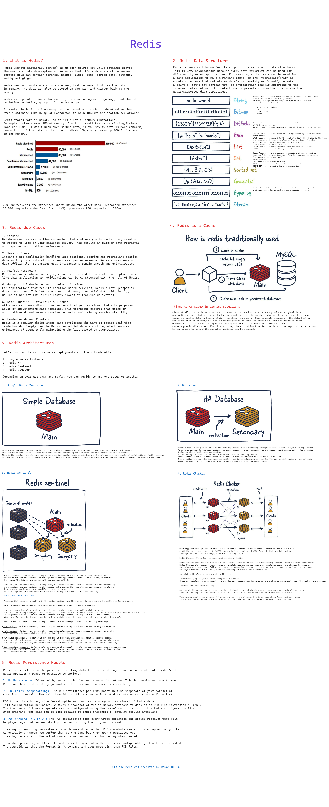

1. **Redis Connection Settings:**

   - `host`: The host number of redis server. In this example, Redis runs on localhost.
   - `port`: The port number of redis server. In this example, 6379.
   - `timeout`: Timeout value for redis connection In this example, 10 seconds (10000 ms).

2. **Lettuce (Java Client for Redis) Settings:**

   - `lettuce`: This section contains settings for the Lettuce library used to interact with Redis.
   - `pool`: Redis connection pool configuration.
     - `max-active`: Specifies the number of concurrent active connections.
     - `max-wait`: Specifies the maximum waiting time to receive a connection. -1 means waiting without a certain amount of time.
     - `max-idle`: Specifies the maximum number of idle connections allowed in the pool.
     - `min-idle`: Specifies the minimum number of idle connections allowed in the pool.

3. **Cache Settings:**
   - `cache`: Contains general cache settings related to the Spring Cache module.
   - `type`: Specifies the type of cache to use. In this example, Redis cache is used.
   - `redis`: Contains Redis cache custom settings.
     - `time-to-live`: Specifies how long an item will be stored in the cache (in seconds).
     - `cache-null-values`: When set to `true`, `null` values ​​are also included in the cache.

## Tech Stack

- Java 17
- Spring Boot 3.0
- Spring Data JPA
- Redis
- MySQL
- Docker
- Lombok

## Requirements

For building and running the application you need:

- [JDK 17 or newer](https://www.oracle.com/java/technologies/javase-downloads.html)
- [Maven](https://maven.apache.org)
- [Redis](https://redis.io/)
- [MySQL](https://www.mysql.com/)
- [Lombok](https://projectlombok.org/)
- [Docker](https://www.docker.com/)

## References

- https://medium.com/@humberto521336/what-is-redis-94c1930bd3c3
- https://architecturenotes.co/redis/
- https://redis.io/docs/latest/operate/oss_and_stack/management/sentinel/
- https://redis.io/docs/latest/operate/oss_and_stack/management/scaling/
- https://www.einfochips.com/blog/redis-cache-and-its-use-cases-for-modern-application/
